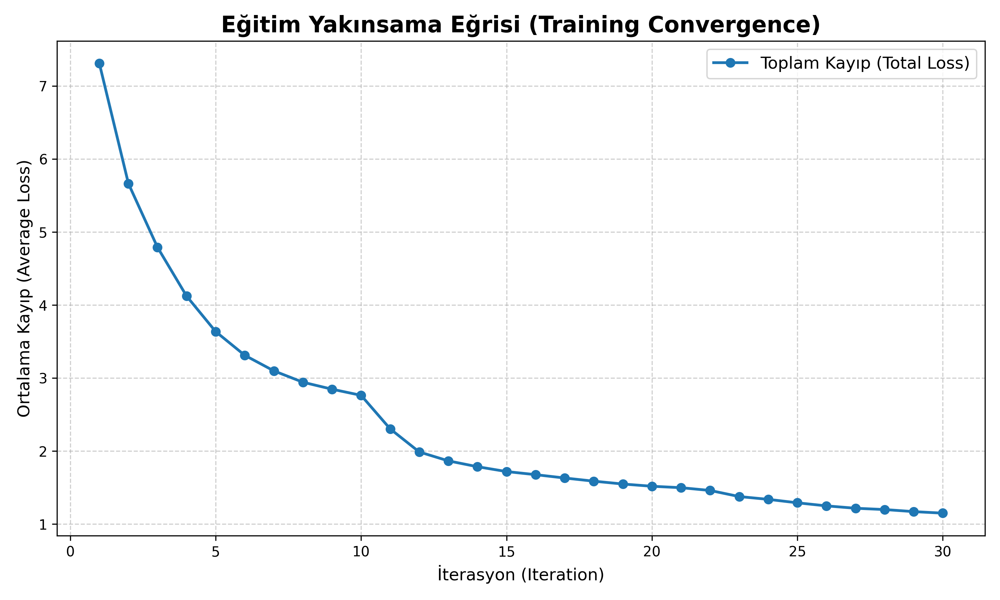
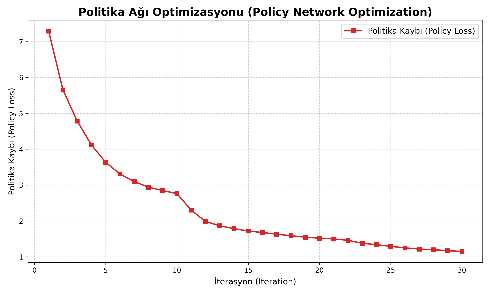

# PEKİŞTİRMELİ ÖĞRENME PROJE RAPORU

## 1. Ortam ve Görev (Environment and Task)

### 1.1 Ortam Adı
Projede kullanılan ortam, klasik **Satranç (Chess)** oyunudur. Oyun, 8x8 karelik bir tahta üzerinde, iki oyuncu (Beyaz ve Siyah) arasında oynanır. Her oyuncunun başlangıçta 16 taşı (1 Şah, 1 Vezir, 2 Kale, 2 Fil, 2 At, 8 Piyon) bulunur. Projede ortamın simülasyonu ve kuralların uygulanması için, Python ekosisteminde standart kabul edilen `python-chess` kütüphanesi kullanılmıştır. Bu kütüphane, hamlelerin yasallığını (legal moves), oyun durumunu (state) ve oyun sonu koşullarını (termination) yönetir.

### 1.2 Ajanın Amacı
Pekiştirmeli Öğrenme (Reinforcement Learning - RL) ajanının temel amacı, verilen herhangi bir tahta durumunda, uzun vadede oyunu kazanma olasılığını maksimize edecek en iyi hamleyi seçmektir. Satranç, toplam bilgili (perfect information), sıra tabanlı (turn-based) ve sıfır toplamlı (zero-sum) bir oyundur. Ajan, hem beyaz hem de siyah taşlarla oynayabilmeyi öğrenmelidir.

Ajanın hedefleri şunlardır:
1.  **Rakibi Mat Etmek:** Rakip şahı tehdit altında bırakıp (şah çekip), rakibin bu tehditten kurtulacak hiçbir yasal hamlesinin kalmamasını sağlamak.
2.  **Kayıptan Kaçınmak:** Kendi şahını mat olmaktan korumak.
3.  **Beraberliği Yönetmek:** Kazanma şansı kalmadığında kaybetmek yerine beraberliği tercih etmek veya kazanabilecekken beraberlikten kaçınmak.

### 1.3 Episode Bitiş Koşulları
Bir eğitim bölümü (episode) -yani bir satranç oyunu- aşağıdaki durumlardan biri gerçekleştiğinde sona erer:

1.  **Mat (Checkmate):** Bir oyuncunun şahı tehdit altındadır ve yasal bir hamlesi yoktur. Oyunu mat eden taraf kazanır.
2.  **Pat (Stalemate):** Sırası gelen oyuncunun şahı tehdit altında değildir ancak yapabileceği hiçbir yasal hamle yoktur. Oyun berabere biter.
3.  **Yetersiz Taş (Insufficient Material):** Tahtada kalan taşlarla (örneğin sadece iki Şah) mat etmenin imkansız olduğu durumdur. Oyun berabere biter.
4.  **Üç Konum Tekrarı (Threefold Repetition):** Oyunun geçmişinde aynı tahta pozisyonu (taşların yerleri, hamle sırası ve haklar dahil) üç kez tekrarlanırsa, oyun berabere biter.
5.  **50 Hamle Kuralı:** Son 50 hamle boyunca hiçbir piyon sürüşü yapılmaz ve hiçbir taş yenmezse, oyun berabere ilan edilebilir.
6.  **Maksimum Adım Sınırı:** Eğitimin sonsuz döngüye girmemesi için belirlenen maksimum hamle sayısı aşıldığında oyun berabere biter.

---

## 2. Problem Tanımı (Problem Definition)

### 2.1 Durum Uzayı (State Space)
Satranç tahtasının durumu, derin sinir ağının işleyebilmesi için sayısal bir tensöre dönüştürülür. Bu projede kullanılan durum uzayı temsili AlphaZero mimarisinden esinlenilmiştir ancak hesaplama maliyetini düşürmek için optimize edilmiştir.

*   **Boyut:** `(Input Channels, Height, Width) = (13, 8, 8)`
*   **Kanalların Dağılımı (Channels):**
    *   **Kanal 0-5 (Bizim Taşlarımız):** Sırasıyla Piyon, At, Fil, Kale, Vezir ve Şah'ın konumları. Taşın olduğu karede 1, olmadığı karede 0 değeri vardır.
    *   **Kanal 6-11 (Rakip Taşları):** Sırasıyla rakibin Piyon, At, Fil, Kale, Vezir ve Şah'ın konumları.
    *   **Kanal 12 (Oyun Sırası):** Ağın, o anki sıranın kimde olduğunu (dolayısıyla hangi taşların "kendi" taşları olduğunu) anlaması için her zaman 1.0 değeriyle dolu bir kanaldır.

*   **Perspektif Dönüşümü:** Ağ, her zaman oyunu "kendi" bakış açısından görür. Eğer sıra Siyah oyuncudaysa, tahta hem dikey olarak ters çevrilir (Rank 1 <-> Rank 8) hem de taş kanalları yer değiştirilir. Bu sayede ağ, beyaz veya siyah oynamaktan bağımsız olarak tek bir strateji öğrenebilir.

### 2.2 Eylem Uzayı (Action Space)
Satrançta bir hamle, bir taşın bir başlangıç karesinden (from_square) bir hedef kareye (to_square) gitmesiyle tanımlanır. Ayrıca piyon terfisi (promotion) durumları da vardır.

*   **Ayrık Eylem Uzayı (Discrete Action Space):** Projede eylem uzayı `64 x 64 = 4096` boyutunda sabit bir vektör olarak tanımlanmıştır.
*   **Hamle Kodlaması:** Her olası `(from_square, to_square)` çifti, `from_square * 64 + to_square` formülü ile 0 ile 4095 arasında benzersiz bir tam sayıya (indeks) eşlenir.
*   **Maskeleme (Masking):** Her durumda, bu 4096 hamlenin sadece çok küçük bir kısmı (ortalama 20-30 tanesi) yasaldır. `get_legal_moves_mask` fonksiyonu ile o anki durumda yasal olmayan hamleler maskelenir (yani olasılıkları sıfırlanır). Bu, ajanın kural dışı hamle yapmasını engeller.
*   *Not: Piyon terfileri bu projede basitleştirme amacıyla otomatik olarak Vezir'e terfi (auto-queen) olarak kabul edilmiştir.*

### 2.3 Ödül Tanımı (Reward Definition)
Pekiştirmeli öğrenme ajanı, çevreden aldığı ödülleri maksimize etmeye çalışır. Satranç gibi oyunlarda ödüller genellikle seyrektir (sparse), yani oyun ortasında iyi bir hamle yapıldığında anında ödül verilmez, sadece oyun sonunda sonuç belli olur.

*   **Kazanma (Win):** `+1.0` puan.
*   **Kaybetme (Loss):** `-1.0` puan.
*   **Beraberlik (Draw):** `0.0` puan.

Eğitim sırasında, oyun bittiğinde elde edilen bu nihai ödül, oyun boyunca yapılan **tüm** hamlelere geri dağıtılır (Backpropagation through time). "Gelecek ödüllerin indirgenmesi" (discount factor) bu projede kullanılmamıştır (`gamma = 1.0`), çünkü satrançta 10. hamlede yapılan bir hata ile 50. hamlede mat olmak doğrudan ilişkilidir ve erken kazanmak ile geç kazanmak arasında (ödül açısından) bir fark gözetilmemiştir.

---

## 3. Kullanılan Algoritma (Current Algorithm)

Projede, DeepMind tarafından geliştirilen ve satranç, shogi, go gibi oyunlarda insanüstü performans gösteren **AlphaZero** algoritmasının basitleştirilmiş bir versiyonu kullanılmıştır. Bu algoritma, **Model Tabanlı (Model-Based)** bir pekiştirmeli öğrenme yaklaşımıdır.

### 3.1 Algoritma Yapısı: Monte Carlo Tree Search (MCTS)
MCTS, oyun ağacını gezerek gelecekteki olası hamleleri simüle eden ve en iyi hamleyi seçen bir arama algoritmasıdır. Algoritma 4 temel aşamadan oluşur:

1.  **Seçim (Selection):** Kök düğümden başlanarak, `UCB` (veya AlphaZero'da `PUCT`) değerini maksimize eden çocuk düğümler seçilerek bir "yaprak" düğüme kadar inilir.
2.  **Genişletme (Expansion):** Seçilen yaprak düğüm eğer oyun sonu değilse, bu düğümden yapılabilecek hamleler ağaca eklenir.
3.  **Değerlendirme (Evaluation):** Klasik MCTS'deki rastgele simülasyonun (rollout) aksine, AlphaZero'da bu adımda **Sinir Ağı** devreye girer. Ağ, o pozisyon için bir Değer ($v$) ve Politika ($\pi$) tahmini üretir.
4.  **Geri Yayılım (Backpropagation):** Ağın ürettiği değer ($v$), o düğümden köke kadar olan tüm ebeveyn düğümlere geri yayılır. Düğümlerin ziyaret sayıları ($N$) ve toplam değerleri ($W$) güncellenir.

```mermaid
graph TD
    A[Seçim (Selection)] -->|En iyi PUCT değeri| B[Genişletme (Expansion)]
    B -->|Sinir Ağı Tahmini| C[Değerlendirme (Evaluation)]
    C -->|Değer (v)| D[Geri Yayılım (Backpropagation)]
    D -->|Ziyaret (N) ve Toplam Değer (W) Güncellemesi| A
```

### 3.2 Sinir Ağı Mimarisi (ResNet) - Detaylı Analiz
Kullanılan ağ, **Residual Network (ResNet)** mimarisine sahiptir. Bu yapı, üç ana bölümden oluşur: Giriş Bloğu, Residual Gövde (Backbone) ve İki Ayrı Çıkış Kafası (Heads).

```mermaid
graph TD
    Input[Girdi: 13 x 8 x 8] --> ConvBo[Conv2D 3x3 + BN + ReLU]
    ConvBo --> R1[ResBlock 1]
    R1 --> R2[ResBlock 2]
    R2 --> |... 7 Blok ...| R7[ResBlock 7]
    
    R7 --> Split{Ayrım Noktası}
    
    Split --> Pol[Policy Head]
    Pol --> |Conv1x1 + BN + ReLU| P_Conv[2 Kanal]
    P_Conv --> |Flatten + Linear| P_Out[Çıktı: 4096 (Softmax)]
    
    Split --> Val[Value Head]
    Val --> |Conv1x1 + BN + ReLU| V_Conv[1 Kanal]
    V_Conv --> |Flatten + Linear| V_Hid[256 Nöron (ReLU)]
    V_Hid --> |Linear| V_Out[Çıktı: 1 (Tanh)]
```

#### A. Giriş Bloğu (Input Block)
Ağ, ham tahta verisini işlemek için özellikleri çıkarmaya başlar.
*   **Katman:** `Conv2d(13, 128, kernel_size=3, padding=1)`
*   **İşlev:** 13 kanallı (piyonlar, atlar, vb.) satranç tahtası görüntüsünü, 128 farklı özellik haritasına (feature map) dönüştürür.
*   **Aktivasyon:** `BatchNormalization` (eğitimi hızlandırmak için) ve `ReLU` (doğrusallığı kırmak için) uygulanır.

#### B. Residual Gövde (Backbone)
Ağın "düşünme" kısmıdır. `config.RESIDUAL_BLOCKS = 7` adet ardışık Residual Bloktan oluşur. Her bir blok şu yapıdadır:
1.  **Konvolüsyon 1:** `Conv2d(128, 128, 3x3)` -> `BatchNorm` -> `ReLU`
2.  **Konvolüsyon 2:** `Conv2d(128, 128, 3x3)` -> `BatchNorm`
3.  **Skip Connection:** Bloğun girişi (x), 2. konvolüsyonun çıkışına doğrudan eklenir. `Output = ReLU(F(x) + x)`.
    *   *Neden?* Bu "atlama bağlantıları", gradyanın kaybolmasını (vanishing gradient) engeller ve ağın çok derinleşse bile stratejik derinliği korumasını sağlar.

#### C. Politika Kafası (Policy Head)
Ağın "Hangi hamleyi yapmalıyım?" sorusuna cevap veren kısmıdır.
1.  **Özellik Daraltma:** `Conv2d(128, 2, kernel_size=1)` ile 128 özellik kanalı 2 kanala düşürülür.
2.  **Düzleştirme (Flatten):** `(2, 8, 8)` boyutundaki veri `128` elemanlı tek bir vektöre çevrilir.
3.  **Çıktı Katmanı:** `Linear(128, 4096)`. 4096 olası hamlenin ham puanlarını (logits) üretir.
4.  **Sonuç:** Bu puanlar MCTS tarafından olasılıklara dönüştürülür.

#### D. Değer Kafası (Value Head)
Ağın "Bu pozisyon ne kadar iyi?" sorusuna cevap veren kısmıdır.
1.  **Özellik Daraltma:** `Conv2d(128, 1, kernel_size=1)` ile 1 kanal (8x8) özet bilgiye indirgenir.
2.  **Gizli Katman:** `Flatten` sonrası `Linear(64, 256)` ile 256 nöronluk bir ara katmandan geçirilir (`ReLU` ile).
3.  **Çıktı Katmanı:** `Linear(256, 1)` ile tek bir skaler değer üretir.
4.  **Aktivasyon:** `Tanh` fonksiyonu kullanılarak çıktı `[-1, +1]` aralığına sıkıştırılır (-1: Kayıp, +1: Kazanç).

### 3.3 Temel Parametreler
*   **`MCTS_SIMULATIONS` (25):** 
    *   Ajanın her hamle öncesi yaptığı simülasyon sayısıdır. 
    *   *(Not: DeepMind orijinal makalesinde 800 simülasyon kullanmıştır. Proje kapsamında hesaplama maliyetini düşürmek ve makul sürelerde eğitim yapabilmek amacıyla bu değer 25 olarak sınırlandırılmıştır - Kaynak Kısıtı).*
*   **`CPUCT` (1.5):** MCTS içindeki Keşif/Sömürü (Exploration/Exploitation) dengesini ayarlayan katsayı.
*   **`LEARNING_RATE` (0.001):** Sinir ağının öğrenme hızı.
*   **`BATCH_SIZE` (256):** Eğitimde kullanılan veri yığını boyutu.
*   **`REPLAY_BUFFER_SIZE` (50,000):** Deneyim tekrarı hafızası.
*   **`TRAIN_EPOCHS` (1):** Her iterasyonda eğitim döngüsü sayısı.

### 3.4 Keşif Yöntemi (Exploration Method)
AlphaZero'da keşif iki aşamada sağlanır:
1.  **Ağaç İçi Keşif (PUCT):** MCTS, bir düğümü seçerken sadece "Değer"i yüksek olanı değil, aynı zamanda az ziyaret edilmiş (ziyaret sayısı `N` düşük olan) düğümleri de seçmeye meyillidir.
2.  **Hamle Seçimi (Temperature Sampling):** Oyunun başında (`EXPLORE_TEMPERATURE_MOVES = 30` hamle boyunca), ajan en çok ziyaret edilen hamleyi doğrudan seçmez. Ziyaret sayılarına dayalı bir olasılık dağılımından rastgele seçim yapar. Bu, ajanın her oyunda farklı açılışlar denemesini sağlar.

---

## 4. Eğitim Süreci (Training Process)

Eğitim süreci, kendi kendine oynama (self-play) ve ağ eğitimi (training) döngüsünden oluşur.

### 4.1 Döngü Yapısı
1.  **Self-Play (Veri Toplama):** 
    *   Mevcut en iyi model kendisiyle (`bot_vs_bot`) `NUM_SELF_PLAY_GAMES` (100) adet oyun oynar.
    *   Bu veriler `ReplayBuffer`'a eklenir.

2.  **Model Eğitimi (Optimization):**
    *   Hafızadan rastgele örnekler çekilir ve ağ eğitilir.
    *   **Kayıp Fonksiyonu:** `Total Loss = Value Loss (MSE) + Policy Loss (Cross Entropy) + Regularization`.

### 4.2 Ortalama Ödül Takibi
*   AlphaZero eğitiminde birincil takip edilen metrik, modelin tahmin hatasını gösteren "Loss" (Kayıp) değeridir. 
*   Eğitim sırasında ajan kendi kendine oynadığı için ortalama ödül her zaman 0'a yakınsar, bu yüzden başarı kriteri Loss'un düşmesi ve dış motorlara karşı performanstır.

### 4.3 Donanım ve Süre (Hardware and Duration)
Bu projenin eğitimi için yüksek performanslı hesaplama kaynakları kullanılmıştır.
*   **Donanım:** NVIDIA A100 GPU
*   **Eğitim Süresi:** Toplam eğitim süreci yaklaşık **4 saat** sürmüştür.

---

## 5. Sonuçlar (Results)

### 5.1 Eğitim Yakınsama Analizi (Convergence Analysis)
Aşağıdaki grafiklerde, eğitim süreci boyunca modelin performans göstergeleri sunulmaktadır.

#### Hata (Loss) Grafiği
Bu grafik, eğitim boyunca modelin toplam kaybının (Total Loss) değişimini göstermektedir.



*   **Toplam Kayıp (Total Loss):** Modelin hem hamle tahminlerindeki (Policy) hem de oyun sonucu tahminlerindeki (Value) kümülatif hatasıdır. Grafik, kaybın `7.3` seviyelerinden `1.15` seviyelerine düştüğünü göstermektedir. Bu, ağın matematiksel olarak "öğrendiğini" ve MCTS öğreticisinin çıktılarına yakınsadığını kanıtlar.

#### Politika Ağı İyileşmesi
Aşağıdaki grafik, özellikle "Politika Kaybı"nın (Policy Loss) düşüşünü göstermektedir.



*   **Politika Kaybı (Policy Loss):** Sinir ağının önerdiği hamle olasılıkları ile MCTS'in (daha derin arama sonucu bulduğu) "gerçek" hamle olasılıkları arasındaki farktır (Cross Entropy).
*   **Yorum:** Politika kaybının düşmesi, sinir ağının artık simülasyon yapmadan da MCTS'in bulacağı kaliteli hamleleri "sezgisel" olarak tahmin edebildiğini gösterir.

### 5.2 Kritik Değerlendirme: Loss vs Oyun Gücü
> [!IMPORTANT]
> **Kritik Not:** "Düşük Loss" her zaman çok iyi oyun anlamına gelmez.

Elde edilen düşük Loss değerleri, sinir ağının **öğreticisini (MCTS) başarılı bir şekilde taklit ettiğini** gösterir. Ancak, eğer öğretici (MCTS) kısıtlı kaynaklar nedeniyle sınırlı bir kapasiteye sahipse (Örn: AlphaZero'nun 800 simülasyonu yerine bizim 25 simülasyonumuz), ağın öğrenebileceği tavan limit de bu öğreticinin kalitesiyle sınırlıdır.

Dolayısıyla modelimiz:
1.  Rastgele oynayan bir rakibe ve acemi oyunculara karşı **çok güçlüdür**.
2.  Stockfish (Seviye 20) gibi bir motora karşı henüz **yeterli değildir**, çünkü öğreticisi (25 simülasyonlu MCTS) Stockfish derinliğinde analiz yapmamaktadır.

### 5.3 Nihai Performans Özeti
Model, eğitim sonunda kurallara tam hakimiyet sağlamış, açılış prensiplerini (merkez kontrolü) öğrenmiş ve basit taktikleri uygulayabilir hale gelmiştir. Eğitim süresince (4 saat, A100 GPU) elde edilen bu yakınsama, algoritmanın doğru çalıştığını ve daha fazla işlem gücü/süre ile çok daha ileri seviyelere ulaşabileceğini doğrulamaktadır.
