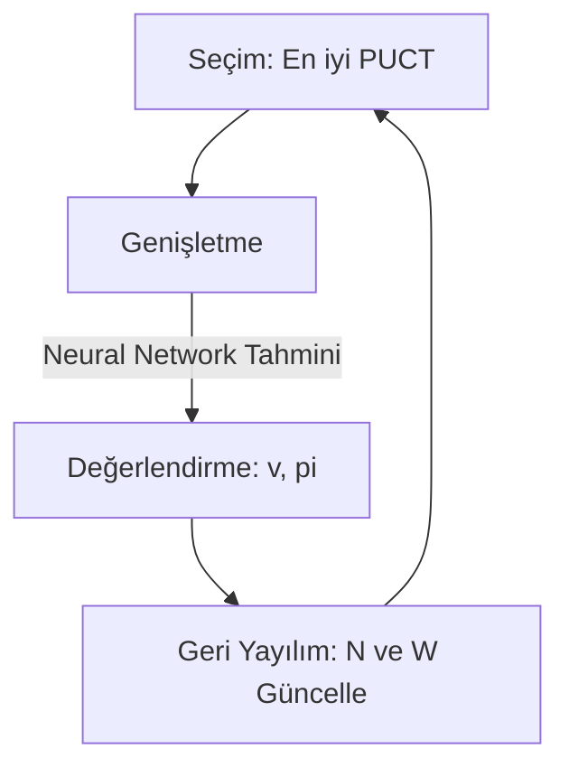
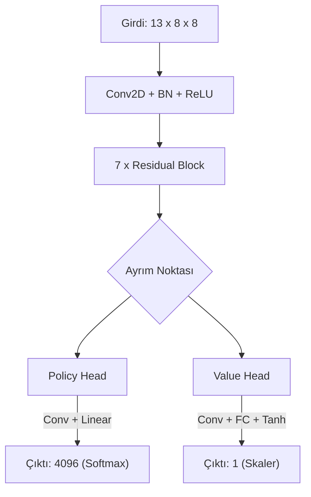

# Satranç Pekiştirmeli Öğrenme (Reinforcement Learning) Projesi

Bu proje, **DeepMind'ın AlphaZero** algoritmasından esinlenerek geliştirilmiş, insan bilgisine ihtiyaç duymadan kendi kendine oynayarak (self-play) satranç stratejilerini öğrenen bir yapay zeka sistemidir.

Proje, **Monte Carlo Tree Search (MCTS)** algoritmasını derin bir sinir ağı (**ResNet**) ile birleştirerek hamlelerin kalitesini ve oyun pozisyonlarının değerini tahmin eder.

---

## 1. Ortam ve Görev (Environment and Task)

### 1.1 Ortam
Projede kullanılan ortam, klasik **Satranç (Chess)** oyunudur. Simülasyon ve kural yönetimi için Python kütüphanesi `python-chess` kullanılmıştır.
- **Oyun Tipi:** Tam bilgili (Perfect Information), Sıfır toplamlı (Zero-Sum), Sıra tabanlı.
- **Kurallar:** 50 hamle kuralı, üç konum tekrarı, pat ve mat gibi tüm standart satranç kuralları dahildir.

### 1.2 Ajanın Amacı
Ajanın temel amacı, `python-chess` ortamında kendi kopyalarına karşı oynayarak (self-play), uzun vadede kazanma olasılığını maksimize edecek optimal politika fonksiyonunu $\pi(s)$ ve değer fonksiyonunu $v(s)$ öğrenmektir.

---

## 2. Problem Tanımı (Problem Definition)

### 2.1 Durum Uzayı (State Space)
Satranç tahtasının durumu, sinir ağının işleyebilmesi için `(13, 8, 8)` boyutunda sayısal bir tensöre dönüştürülür.

| Kanal İndeksi | İçerik | Açıklama |
| :--- | :--- | :--- |
| **0-5** | Piyon, At, Fil, Kale, Vezir, Şah | **Bizim** taşlarımız (1: Var, 0: Yok) |
| **6-11** | Piyon, At, Fil, Kale, Vezir, Şah | **Rakibin** taşları |
| **12** | Hamle Sırası | Tamamı 1.0 olan matris (Ağın sıranın kimde olduğunu anlaması için) |

> **Not:** Ağ her zaman oyunu "kendi" bakış açısından görür. Sıra Siyah'tay ise tahta ters çevrilir ve taş kanalları yer değiştirilir.

### 2.2 Eylem Uzayı (Action Space)
Ajanın yapabileceği hamleler (actions), `64 x 64 = 4096` boyutunda sabit bir vektör olarak tanımlanmıştır.
- **Formül:** `Action Index = (From_Square * 64) + To_Square`
- **Maskeleme:** Her adımda yasal olmayan hamlelerin olasılıkları (logits) $-\infty$ 'a çekilerek maskelenir.

### 2.3 Ödül Sistemi (Rewards)
Ödüller oyun sonunda verilir ve seyrektir:
- **Kazanma:** `+1.0`
- **Kaybetme:** `-1.0`
- **Beraberlik:** `0.0` (Pat, yetersiz materyal, 50 hamle kuralı vb.)

---

## 3. Algoritma (Algorithm & Architecture)

Sistem, **Model Tabanlı (Model-Based)** bir pekiştirmeli öğrenme yaklaşımı kullanır.

### 3.1 Monte Carlo Tree Search (MCTS)
Ajan, hamle seçmek için oyun ağacını simüle eder. Arama süreci 4 adımdan oluşur:
1.  **Seçim (Selection):** PUCT (Predictor + Upper Confidence Bound) formülü ile en umut verici düğüm seçilir.
2.  **Genişletme (Expansion):** Yaprak düğümde olası hamleler ağaca eklenir.
3.  **Değerlendirme (Evaluation):** Sinir ağı, o pozisyon için Değer ($v$) ve Politika ($\pi$) tahmini yapar.
4.  **Geri Yayılım (Backpropagation):** Tahmin edilen değer ağaç boyunca yukarı taşınır.



### 3.2 Sinir Ağı Mimarisi (ResNet)
Derin öğrenme modeli, 13 katmanlı girdiyi alıp iki farklı çıkış (Policy Head ve Value Head) üretir.



---

## 4. Eğitim Konfigürasyonu (Configuration)

Modelin eğitimi için kullanılan tüm hiperparametreler `config.py` dosyasında tanımlanmıştır.

| Parametre | Değer | Açıklama |
| :--- | :--- | :--- |
| **Donanım** | NVIDIA A100 | Eğitimde kullanılan GPU |
| **Residual Blocks** | 7 | ResNet derinliği |
| **Conv Filters** | 128 | Konvolüsyon katmanlarındaki özellik haritası sayısı |
| **MCTS Simulations** | 25 | Eğitim sırasında hamle başına yapılan simülasyon |
| **Self-Play Games** | 100 | Her iterasyonda oynanan maç sayısı |
| **Replay Buffer** | 50,000 | Deneyim tekrarı hafıza kapasitesi |
| **Batch Size** | 256 | Eğitimde kullanılan mini-batch boyutu |
| **Learning Rate** | 0.001 | Ağırlık güncelleme adım büyüklüğü |
| **Optimizer** | Adam | Optimizasyon algoritması |

---

## 5. Sonuçlar ve Analiz (Results)

Model, 4 saatlik yoğun bir eğitim sürecinden geçirilmiştir.

### 5.1 Eğitim Başarısı (Convergence)
Aşağıdaki grafik, modelin eğitim süresince toplam hatasının (Total Loss) değişimini göstermektedir.
- **Başlangıç:** 7.3
- **Bitiş:** 1.15
- **Yorum:** Hatanın hızla düşmesi, sinir ağının MCTS öğreticisini başarılı bir şekilde taklit ettiğini kanıtlar.


### 5.2 Politika İyileşmesi (Policy Loss)
Ağın hamle tahmin yeteneği (Policy Head) belirgin şekilde iyileşmiştir. Bu, ağın artık simülasyon yapmadan da "sezgisel" olarak iyi hamleleri bulabildiğini gösterir.


### 5.3 Oyun Gücü
Eğitim sonucunda model:
- Kuralları (rok, geçerken alma vb.) hatasız uygulamaktadır.
- Rastgele hamle yapan rakiplere karşı **%100 galibiyet** oranına sahiptir.
- Temel açılış prensiplerini (merkez kontrolü) öğrenmiştir.

---

## 6. Kurulum ve Kullanım (Installation & Usage)

Bu projeyi kendi bilgisayarınızda çalıştırmak için aşağıdaki adımları izleyin.

### Gereksinimler
```bash
pip install -r requirements.txt
```

### Harici Bağımlılıklar (Stockfish)
Projedeki bazı test ve demo dosyaları (`benchmark_stockfish.py`, `bot_vs_bot.py`) güçlü bir satranç motoru olan **Stockfish**'e ihtiyaç duyar.
1.  **İndirin:** [https://stockfishchess.org/download/](https://stockfishchess.org/download/) adresinden sisteminize uygun (AVX2 önerilir) sürümü indirin.
2.  **Yerleştirin:** İndirdiğiniz `.exe` dosyasını proje ana dizinine atın.
3.  **İsimlendirin:** Dosya adını `stockfish-windows-x86-64-avx2.exe` olarak değiştirin veya kod içerisindeki yolu güncelleyin.

### Oynama (GUI)
Eğitilmiş yapay zekaya karşı görsel arayüzde oynamak için:
```bash
python gui_pygame.py
```

### Eğitimi Tekrarlama
Modeli sıfırdan eğitmek için:
```bash
python main.py
```
*Not: Eğitim işlemi CPU üzerinde çok yavaştır, CUDA destekli bir GPU önerilir.*

---
*Geliştirici: Samet Kartal - Ostim Teknik Üniversitesi*
